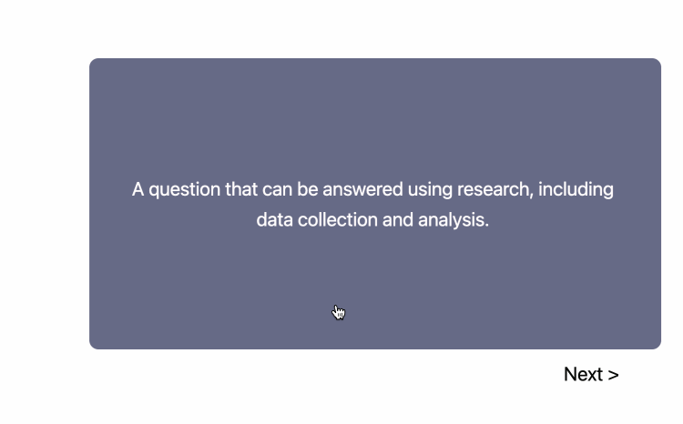

# Data Science Flashcards

Currently 199 flashcards on Data Science topics, including data visualizaton, Pandas, probability, statistics, and dimensionality reduction (but **not** machine learning). More to come.

Below is an animated GIF to show the idea. Click on the GIF or the link below for the real flashcards.

[Access the interactive flashcards](https://jmshea.github.io/data-science-flashcards/)
